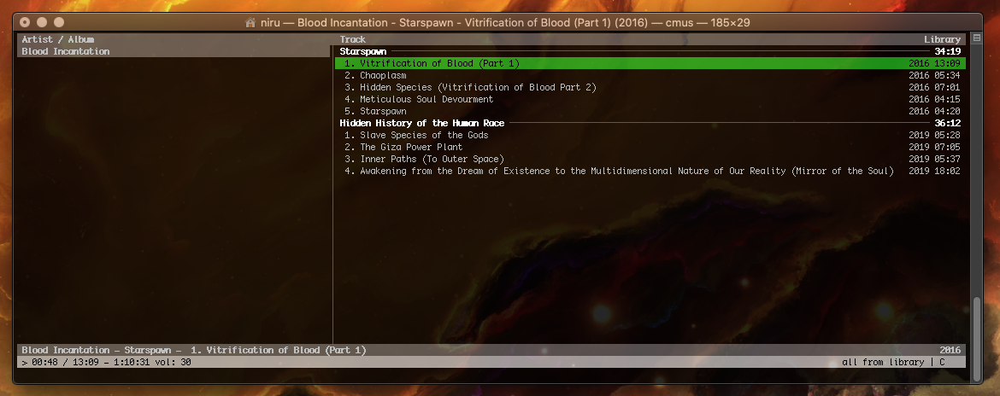

# cmus-bloodincantation
Dark color scheme for cmus music player.
Inspired by the band Blood Incantation. 

Installation: Place bloodincantation.theme in cmus directory. Example: ~/.config/cmus/

Load theme in cmus: :colorscheme bloodincantation

Screenshot macosx:

